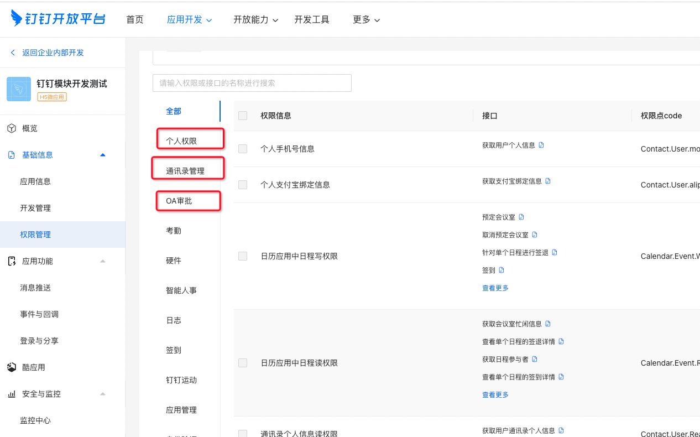
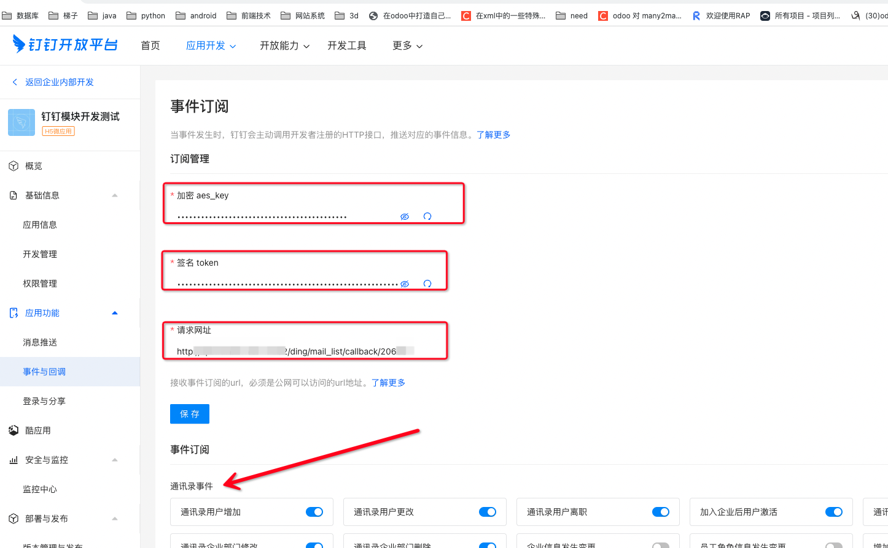
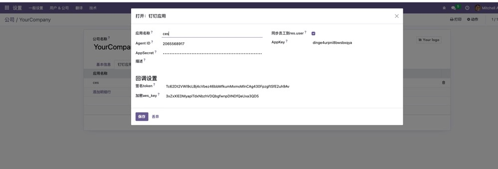
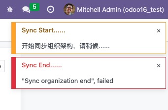
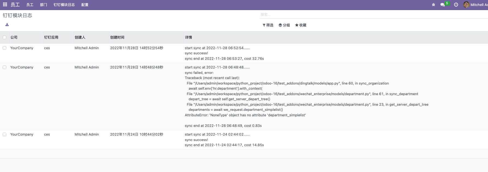
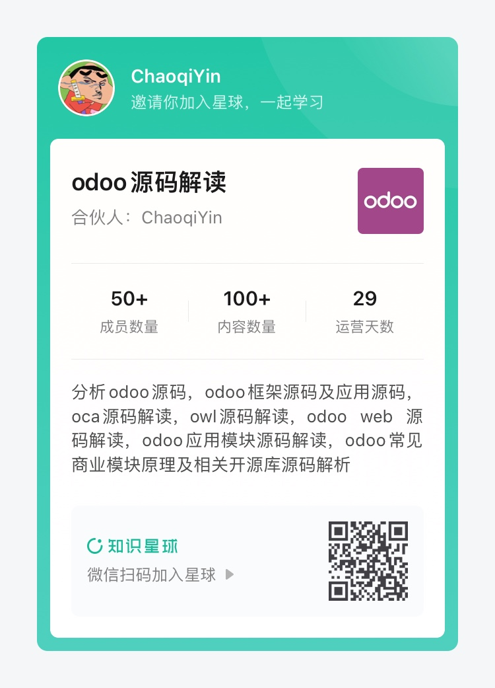

# xy_dingtalk
适用于Odoo16版本的钉钉模块

<div>  

[](https://github.com/xunonxyz/xy_dingtalk/blob/master/LICENSE.md)
[](https://github.com/xunonxyz/xy_dingtalk/issues)
[](https://github.com/odoo/odoo/tree/16.0)

</div>

## ✨ 特点

- 采用python升级特性协程进行同步，速度比多线程更快。同步50人公司组织架构只需20s左右
- 仅inherit了少量model，避免多层inherit冗余嵌套影响加载性能
- 支持Odoo多公司切换，每个公司可设置多个钉钉应用
- 兼容企业微信模块，可与[企业微信模块](https://github.com/xunonxyz/xy_wechat)一起安装共存
- 使用Hr模块为基础进行员工管理，而不是直接res.users，充分利用Odoo原生模块功能
- 完整的i18n简中翻译，默认使用英文
- 包含钉钉内建应用必备功能，去掉了其余冗余而普遍用不上的功能，减少模块大小

## 🖥 环境支持

- Odoo16版本
- postgresql12及以上版本（Odoo16的hr模块中使用了Json字段，需要数据库有Json函数支持）
- python3.7及以上（使用了协程特性）
- 安装python的`aiohttp`和`pycryptodome`库

## 📦 安装

在Odoo的应用里找到`DingTalk`模块激活即可安装，安装后模块名称翻译会被加载变成「钉钉」

## ✨ 包含功能

|                功能名称                | 是否支持 |
| :------------------------------------: | :------: |
|             多公司用户切换             |    √     |
|     钉钉应用access_token获取并缓存     |    √     |
|    钉钉应用通讯录部门、成员一键同步    |    √     |
|      钉钉通讯录部门、成员变更回调      |    √     |
| 钉钉二维码扫码登录系统(有widget可使用) |    √     |
|          钉钉网页跳转登录系统          |    √     |
|             向钉钉上传素材             |    √     |
|           推送钉钉各类型消息           |    √     |
|               钉钉OA审批               |    √     |

## ✨ 后续其他计划

- odoo工作流模块，对标java的Camunda工作流实现，可在线编辑
- odoo oa模块
- odoo商城模块
- ......


## 🔨 使用

注：因为odoo的hr模块是以部门为单位进行管理，所以目前仅支持同步钉钉应用可见范围以部门为单位的情况，有单独可见人员时不会同步单独可见人员

以下说明文档包含关键配置使用，其余具体调用函数请到源码自行查看  

### 配置钉钉应用参数

#### 在钉钉中配置

> 注：以下两个配置在保存时企业微信均会发送请求到配置的地址进行验证，故需要企业微信和odoo配置同时进行 

##### 事件回调参数

> 把需要用到的权限全部勾选上（不清楚需要哪些就把红框内的三种权限全部勾选）




> 获取钉钉事件回调的aes_key和token，并配置请求回调地址为`{odoo服务器地址，不能使用localhost}/ding/mail_list/callback/{回调时对应的应用的agent_id}`，具体接口见代码controllers/controllers:ding_callback




#### 在odoo中配置

在「Odoo系统 - 设置 - 用户&公司」页面，选中公司后切换到「钉钉应用」选项卡进行参数配置

注：如果勾选了应用中的「同步员工到res.user」则在保存hr.employee记录时也会创建res.users记录，否则仅创建hr.employee   



##### 配置回调参数

将在钉钉中生成的aes_key和token填入参数处   


### 同步

配置完参数后点击「同步组织架构」按钮即可。同步是在后端异步进行，不会阻塞当前操作，但尽量不要进行用户、部门的变更、创建、删除等操作。

同步完成或失败后均会有通知窗进行通知。  



### 同步日志

每次同步的结果、报错代码栈、花费的时间等信息均可以进行查看。

在「员工 - 钉钉模块日志」页面可进行查看  



### 配置扫码登录后台

扫码组件在模块内部作为一个widget进行封装，可以在任意地方进行使用，有两种方式进行使用
1. 在view中能使用`<widget>`标签的地方使用`<widget name="ding_qrcode" app_id="传入app的在系统内的id"/>`即可
2. 将使用owl进行封装的扫码组件进行引入，然后在需要使用的地方mount扫码组件，比如：
```javascript
import DingTalkQrcode from '@xy_dingtalk/js/ding_qrcode_widget';
const { mount } = owl;

mount(DingTalkQrcode, document.body, { props: {appId: '传入app的在系统内的id'} });
```

## ❤️ 支持

富能通企业官网：https://www.funenc.com/

免费后端培训视频系列：https://www.bilibili.com/video/BV1rP411G7CZ/

知识星球Odoo源码解读：



更多模块请进群交流: 


